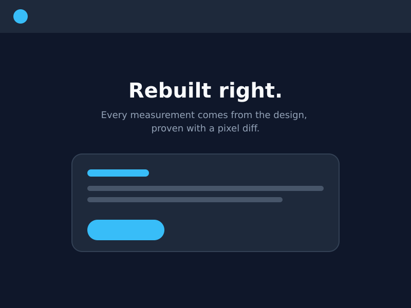
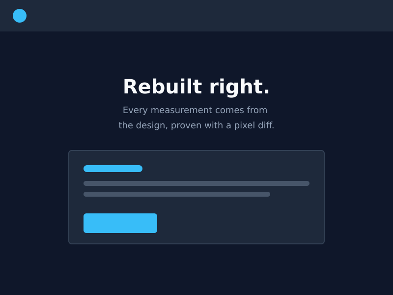
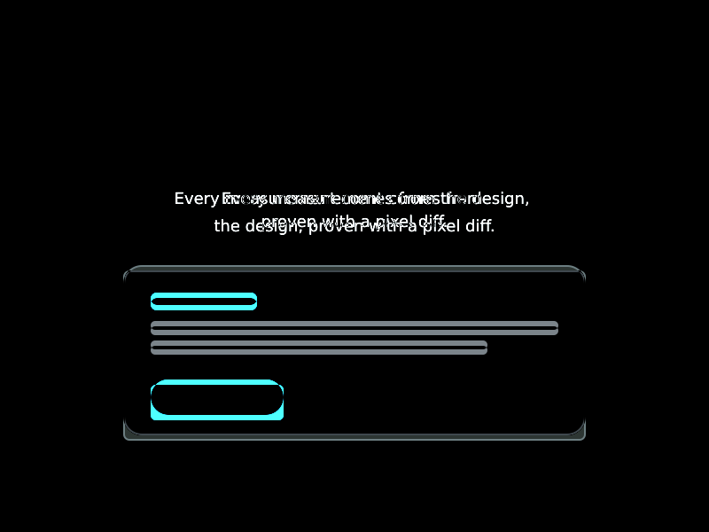

# pixel-perfect-design-implementor

An agent skill (plus standalone scripts) for implementing a design in a web app so the rendered page is **pixel-identical to the design, and proven to be by numbers**, not by eyeballing a screenshot.

It is **design-tool agnostic**. Figma, Sketch, Penpot, Adobe XD, Framer, an HTML prototype, a PNG or PDF mockup, or a screenshot of an existing site all work, as long as the source gives you a reference render and enough measurements to build from. See [What counts as a design source](#what-counts-as-a-design-source).

## The idea

Screenshots lie. Two renders can look "basically the same" and still differ by a 6px shift, a wrong corner radius, or a line that wraps one word earlier. This skill replaces "looks right" with a loop that converges:

```
gather ground truth ─► build on a proportional canvas ─► screenshot at the design's exact width
        ▲                                                            │
        │                                                            ▼
   fix the worst band ◄─ read the difference heatmap ◄─ rank mismatches by band (mean abs RGB)
```

You stop when only text antialiasing is left in the heatmap.

## What it can do

Everything below is a generic example; swap in your own page and design.

### 1. Implement a design from a link or file

> "Implement this design as `/pricing` at 1440 and 390 wide. Match it exactly and show me the diff."

Works with a Figma/Penpot URL, a Sketch/XD export, or a folder of PNGs. The agent pulls the spec, downloads assets, builds both layouts on a proportional canvas, and reports per-frame diff numbers with the heatmaps.

### 2. Build from nothing but a flat mockup

> "Here is `landing.png` (1440 wide) and the brand font files. Build the page."

With no structured spec, the agent measures the image itself (text rows, bounding boxes, exact colors) using `scripts/probe.mjs`, then verifies against the same image. It says so when it is working from pixels only, and that the text can only be as exact as the font match.

### 3. Match an existing site

> "Make `/about` look exactly like `https://example.com/about`."

The live site is the design: the agent screenshots it for the reference render and reads boxes and computed styles from the DOM instead of measuring pixels.

### 4. Fix design-fidelity feedback

> "The hero wraps wrong, the cards have gray boxes around the images, and the radii are off."

These are the three classic failures, and the skill knows the cause of each: unforced line breaks, flattened-transparency exports, and eyeballed radii. It reproduces the problem in the diff first, then fixes it.

### 5. Audit a page against its design

> "Compare my live `/checkout` against `checkout-design.png` and rank the worst mismatches."

No code changes: just the ranked band list, heatmap, and a short diagnosis of each hotspot.

## What the output looks like

The repo includes a synthetic demo (`npm run demo`) with three planted mistakes in the "live" page: the card sits 6px low, the corner radii are wrong, and the subtitle has a different wrap and line pitch.

| Design | Live page | Difference heatmap (×3) |
|---|---|---|
|  |  |  |

`diffcheck.mjs` ranks the bands, worst first:

```
worst 20 bands (liveY / designY / meanAbsDiff):
360   360   15.04     ← the card contents, shifted
220   220   13.98     ← the subtitle, wrong wrap + line pitch
380   380   12.42
240   240   12.31
...
overall mean: 3.119
```

How to read the heatmap (solid black means identical):

| What you see | What it means | Action |
|---|---|---|
| Solid shapes, doubled edges (the card outline, the button) | Layout or graphics error: wrong offset, size, radius, or a missing asset | Fix it |
| Text that appears twice, offset | Wrong line pitch, baseline, or wrap | Calibrate the font, force the line breaks |
| Faint glyph outlines only, overall mean about 5–8 | The text-antialiasing floor of HTML rendering | Stop; you are done |
| One text block bright while the rest is faint | Wrong font face or weight | Check which file actually painted |

## What counts as a design source

The agent checks for five things before it builds, and asks you for whatever it cannot measure rather than guessing.

| Need | Why | Minimum |
|---|---|---|
| Reference render at a known width | The diff runs against it; line wraps are read off it | One 1x PNG per frame |
| Geometry (x, y, w, h) | Exact placement | A structured spec, or measured with `probe.mjs` |
| Typography | Size, line-height, tracking, color | A spec sheet, or the render plus the font files |
| Colors, radii, strokes, effects | Exact values | A spec, or sampled from the render |
| Assets | Logos, photos, icons with real transparency | SVG or original uploads |

Sources come in three tiers; higher tiers converge faster, and the agent reports which tier it was on.

| Tier | Source | How the spec is obtained |
|---|---|---|
| A: structured | Figma, Penpot, Sketch, Adobe XD, Framer, HTML prototype, Storybook | API/MCP/CLI exports, JSON dumps, or the DOM |
| B: exports + spec sheet | PNG/SVG/PDF handoff with a spacing and type doc | The doc for tokens, the render for verification |
| C: pixels only | A PNG mockup or screenshot | Measured with `probe.mjs` |

Per-tool commands and traps are in [`references/design-sources.md`](skills/pixel-perfect-design-implementor/references/design-sources.md). Figma gets a dedicated page ([`figma.md`](skills/pixel-perfect-design-implementor/references/figma.md)) because its MCP has well-known quirks. The Figma workflow is the one that has been exercised on real projects; the other tools' commands are documented from their public tooling, so expect to adjust them.

## Install

### As a Claude Code skill

```bash
git clone https://github.com/CamJW101/pixel-perfect-design-implementor.git
cp -r pixel-perfect-design-implementor/skills/pixel-perfect-design-implementor ~/.claude/skills/
# or per-project:  <your-repo>/.claude/skills/
```

The skill triggers on phrases like "match the design exactly", "pixel perfect", or when you share a design to implement. Its scripts need two packages in the project you run them from:

```bash
npm i -D sharp @playwright/test
npx playwright install chromium
```

### With any other agent or by hand

`skills/pixel-perfect-design-implementor/SKILL.md` is plain Markdown; paste it into your agent's instructions or read it as a checklist. The scripts are standalone Node ES modules with no framework assumptions.

## The scripts

| Script | What it does |
|---|---|
| `shots.mjs` | Full-page screenshots at exact CSS widths, with fonts settled and overlays hidden (`--hide`, `--wait`) |
| `diffcheck.mjs` | Mean absolute RGB difference per 20px band, ranked worst first |
| `diffimg.mjs` | Per-pixel difference heatmap PNG, amplified ×3 |
| `probe.mjs` | Measure a raster design: `pixel` colors, content `bbox`, text `rows`, region `palette` |
| `to-avif.mjs` | PNG → AVIF (quality 85, 4:4:4 chroma, alpha kept) for shipping art |
| `unblend.mjs` | Recover true transparency from two exports of the same art on different backings |

```bash
# capture at the frame's exact width
node scripts/shots.mjs ./shots --hide=".cookie-banner" "home-desktop=http://localhost:3000/@1440"

# rank mismatches, then look at them (0 0 = images already aligned vertically)
node scripts/diffcheck.mjs design.png shots/home-desktop.png 0 0 3200
node scripts/diffimg.mjs   design.png shots/home-desktop.png 0 0 3200 heatmap.png

# measure a flat mockup
node scripts/probe.mjs rows    mockup.png 120 400 600 300   # text lines: y range + height
node scripts/probe.mjs bbox    mockup.png 100 300 700 400   # element x, y, w, h
node scripts/probe.mjs pixel   mockup.png 24 24 400 90      # exact colors
node scripts/probe.mjs palette mockup.png 0 0 1440 700 5    # dominant colors
```

## How it gets pixel-identical text

Browsers and design tools disagree about text in three systematic ways: line-height ("Auto" vs `normal`), first-baseline position, and glyph advance widths. The skill measures all three per font family and pins the corrections, then hard-codes line breaks to the design's own wraps, because natural wrapping flips on sub-percent metric noise. The procedure is in [`references/calibration.md`](skills/pixel-perfect-design-implementor/references/calibration.md); the proportional-canvas layout system (`--u: calc(100cqw / frameWidth)`) is in [`references/canvas.md`](skills/pixel-perfect-design-implementor/references/canvas.md).

## Limits, stated plainly

- Text is only as exact as the font match. With the real font files, text lands at the antialiasing floor; with a substitute face, it will not, and the agent should say so.
- Pixels-only sources (tier C) cannot reveal hidden structure: hover states, responsive rules, and anything the image does not show are guesses, and are reported as deviations.
- The diff compares one frame width at a time. The proportional canvas is how other widths stay faithful, and the skill spot-checks off-frame widths rather than diffing them.
- The Playwright capture uses Chromium; other engines rasterize text differently.

## Repo layout

```
skills/pixel-perfect-design-implementor/
  SKILL.md                  the skill
  references/               design-sources, figma, calibration, canvas
  scripts/                  shots, diffcheck, diffimg, probe, to-avif, unblend
examples/make-demo.mjs      builds the demo images and runs the diff
docs/demo/                  design.png, live.png, heatmap.png
```

## License

MIT
